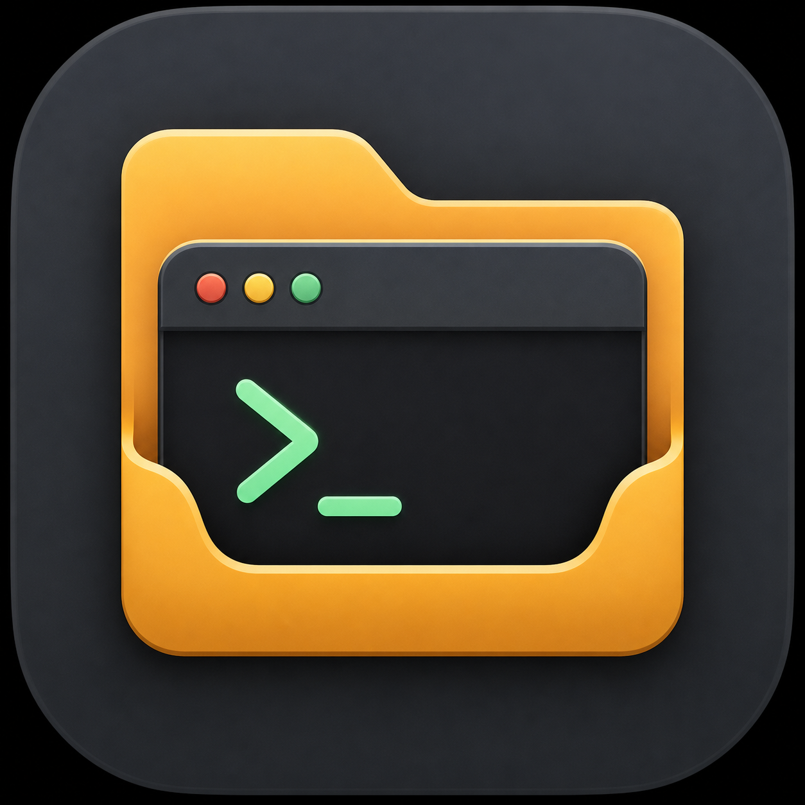

# Folder Terminal

<p align="center">
  
</p>

<p align="center">
  A native macOS workspace that puts Finder-like file browsers and real terminal sessions in one persistent split view.
</p>

Folder Terminal is designed around a simple idea: browsing a folder and changing a shell's working directory should be related, but never confused. File panels can be linked to terminal panels without silently moving a running shell. When you deliberately choose **Go Here in Terminal**, Folder Terminal sends an explicit, shell-escaped `cd` command.

## Highlights

- Native SwiftUI macOS application with live terminal sessions powered by [SwiftTerm](https://github.com/migueldeicaza/SwiftTerm)
- Persistent editor-style split layouts containing any mix of browser and terminal panels
- Finder-style list, column, and tree views with breadcrumbs and keyboard navigation
- File operations including create, rename, duplicate, copy, paste, drag-and-drop, and Move to Trash
- Explicit links between browser and terminal panels, with independently tracked pinned and live shell locations
- Workspace restoration for layouts, panel settings, links, and folder access
- Graphite, Midnight, and Mocha themes with matching terminal colour palettes
- No telemetry or account required

Folder Terminal requires **macOS 14 Sonoma or later**.

## Install

### Download the app

1. Download `FolderTerminal-<version>-macOS.zip` from the [latest release](https://github.com/alexiamhe93/folder-terminal/releases/latest).
2. Unzip it and move **FolderTerminal.app** to your Applications folder.
3. On first launch, Control-click the app, choose **Open**, then confirm **Open**.

Release downloads are currently ad-hoc signed rather than Apple-notarised. macOS may therefore identify the developer as unverified. The Control-click flow creates a local exception for the app without disabling Gatekeeper globally. If macOS instead shows **Open Anyway**, use it under **System Settings → Privacy & Security** after attempting the first launch.

### Build from source

Building needs a Swift 6 toolchain — either a full Xcode or the Command Line
Tools alone (`xcode-select --install`):

```sh
git clone https://github.com/alexiamhe93/folder-terminal.git
cd folder-terminal
make install
```

This builds an ad-hoc-signed app and installs it to `~/Applications`. Run `make app` to create `dist/FolderTerminal.app` without installing it.

You can also open `Package.swift` in Xcode and run the generated `FolderTerminal` scheme, or launch a development build with:

```sh
swift run FolderTerminal
```

## Using Folder Terminal

The app opens one shared workspace window. Add browser and terminal panels, split the selected panel, and drag panel headers to rearrange the layout.

### Essential shortcuts

| Shortcut | Action |
| --- | --- |
| `⇧⌘F` / `⇧⌘T` | Add a browser or terminal panel |
| `⌘D` / `⇧⌘D` | Split the selected panel vertically or horizontally |
| `⌘W` | Close the selected panel |
| `⇧⌘W` | Close the window |
| `⌘O` | Choose the selected browser's root folder |
| `⌘↩` | Go to the selected browser folder in linked terminals |
| `⇧⌘N` | Create a folder in the selected browser |
| `⌥⌘C` | Copy selected paths, one per line |
| `⌘K` | Clear the selected terminal |
| `⌘,` | Open settings |

In a browser, use `↑`/`↓` to select, `Space` for Quick Look, `Return` to rename, `⌘↓` to open, `⌘↑` for the enclosing folder, and `⌘⌫` to move selected items to Trash.

### Browser–terminal links

Browsing is passive: navigating a linked browser never changes a terminal. **Go Here in Terminal** is the explicit action that changes directory and pins that folder as the terminal's starting location. The compact terminal status distinguishes:

- the linked browser;
- the saved pinned folder; and
- the shell's current live location.

The live shell location is runtime-only and is not restored from disk. Removing a pin never changes the running shell.

## Development

The project is a Swift Package with a small testable core module:

```text
Sources/FolderTerminal/       SwiftUI and AppKit application code
Sources/FolderTerminalCore/   Layout, persistence, paths, and file operations
Tests/FolderTerminalCoreTests Core unit tests
scripts/                      App and release packaging
```

Run the automated checks:

```sh
swift build
make test
make app
```

Use `make test` rather than `swift test` — it supplies the swift-testing search
paths that a Command-Line-Tools-only install does not provide, and is a plain
`swift test` when a full Xcode is present.

The extended manual regression checklist is in [TESTING.md](TESTING.md). See [CONTRIBUTING.md](CONTRIBUTING.md) before proposing a change.

### Create a local release archive

```sh
SWIFT_ARCHS="arm64 x86_64" make release
```

This produces a universal app archive and SHA-256 checksum in `dist/`. Pushing a version tag such as `v0.1.0` runs the same checks and publishes these files through GitHub Releases.

## Security and sandboxing

Folder Terminal intentionally runs unsandboxed because each panel hosts a real login shell and the file browser works with user-selected folders. This gives shell processes the same permissions they would have in Terminal.app. Review commands before running them and only install builds from sources you trust.

Please report security issues privately as described in [SECURITY.md](SECURITY.md).

## Contributing

Bug reports, focused feature proposals, documentation improvements, and pull requests are welcome. The terminal lifetime and file-operation behaviours have deliberate safety constraints, so please include regression coverage or manual verification for changes in those areas.

## License

Folder Terminal is available under the [MIT License](LICENSE).
